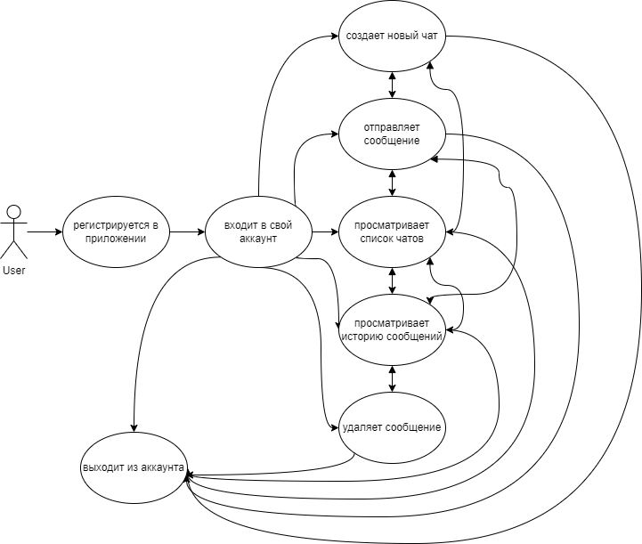
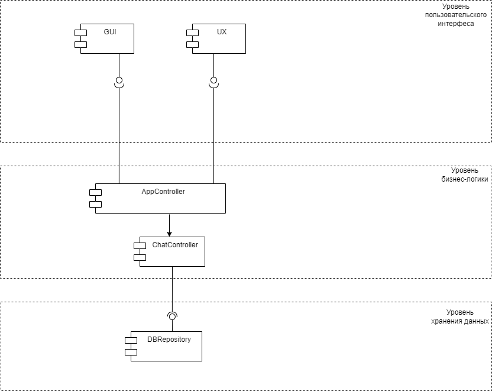
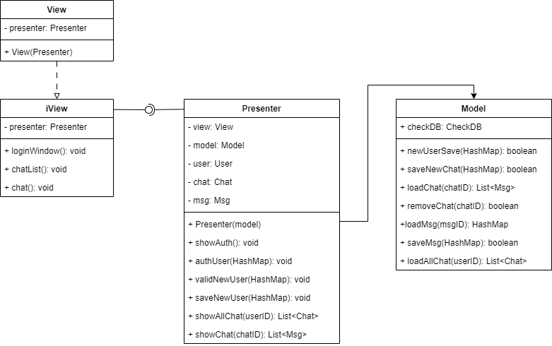
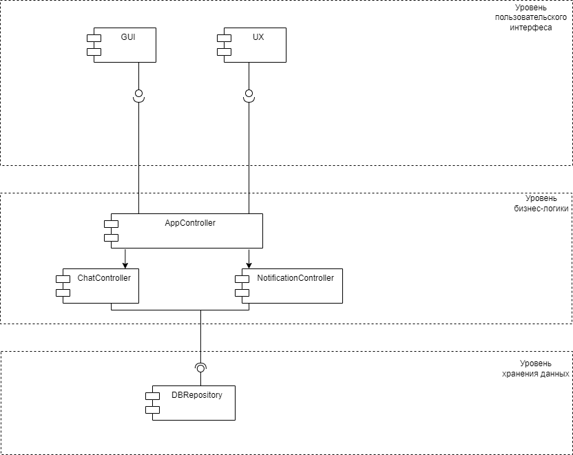
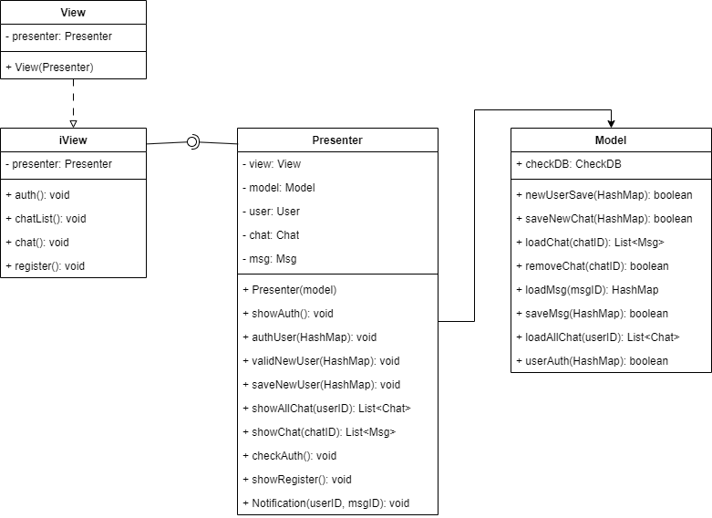

### Структура приложения с пользовательским интерфейсом и базой данных (паттерн Repository)

Архитектура: MVP (Model-View-Presenter)
MVP была выбрана, так как она обеспечивает разделение логики приложения на три основных компонента: модель, представление и презентер. Это позволяет упростить разработку и поддержку приложения, а также обеспечить его масштабируемость.

Используя метод персон, выявили каких функций не хватает:
1. Нет регистрации
2. Нет проверки авторизации
3. Нет уведомлений

Исправленные UML и ERD:

[Design](https://github.com/PolitovAS/Software_architecture/blob/main/HW_10/Design.pdf)