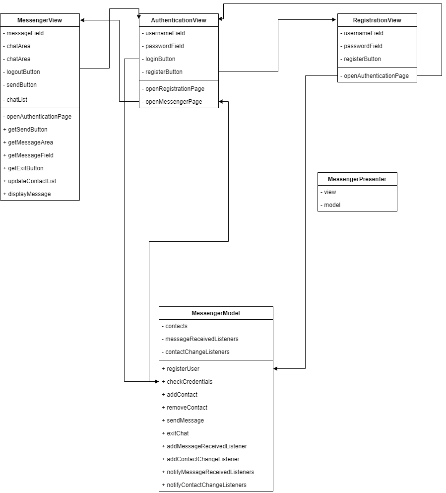
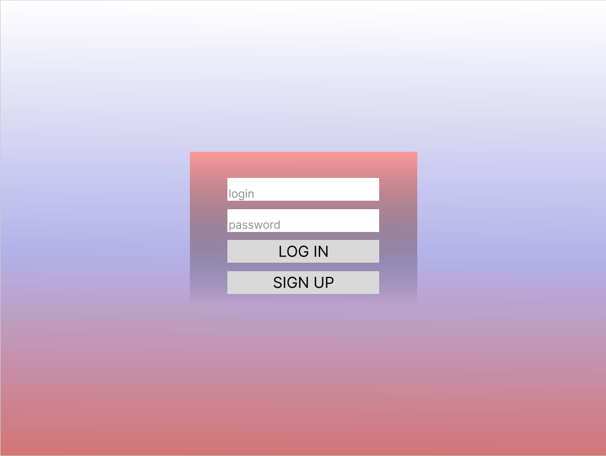
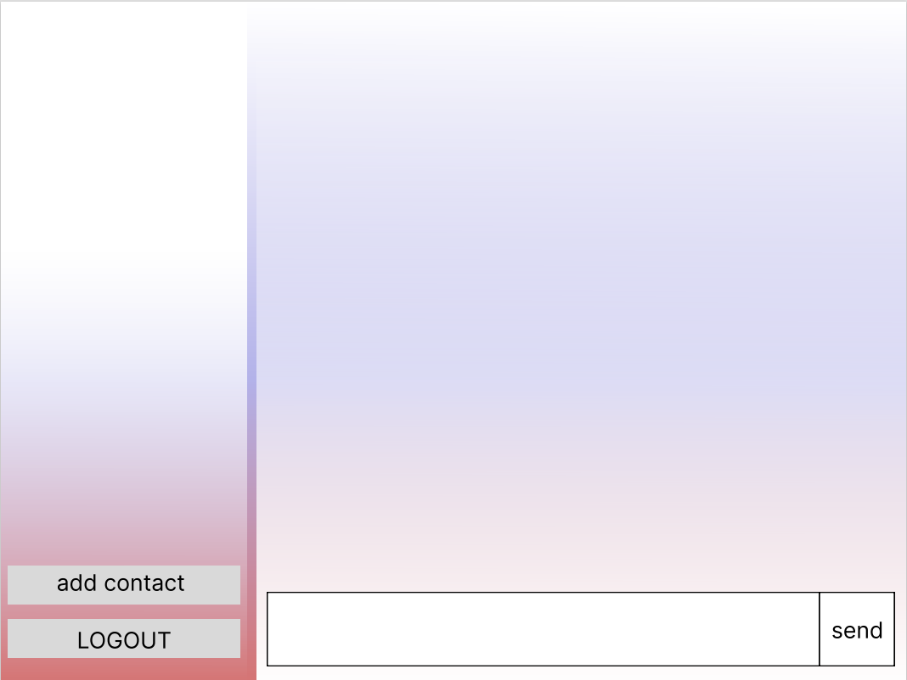
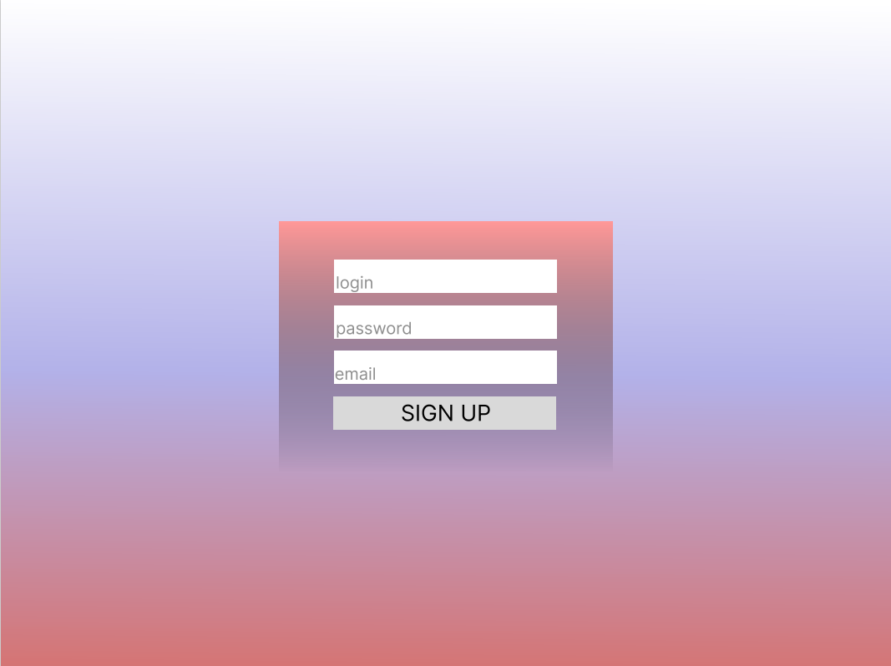
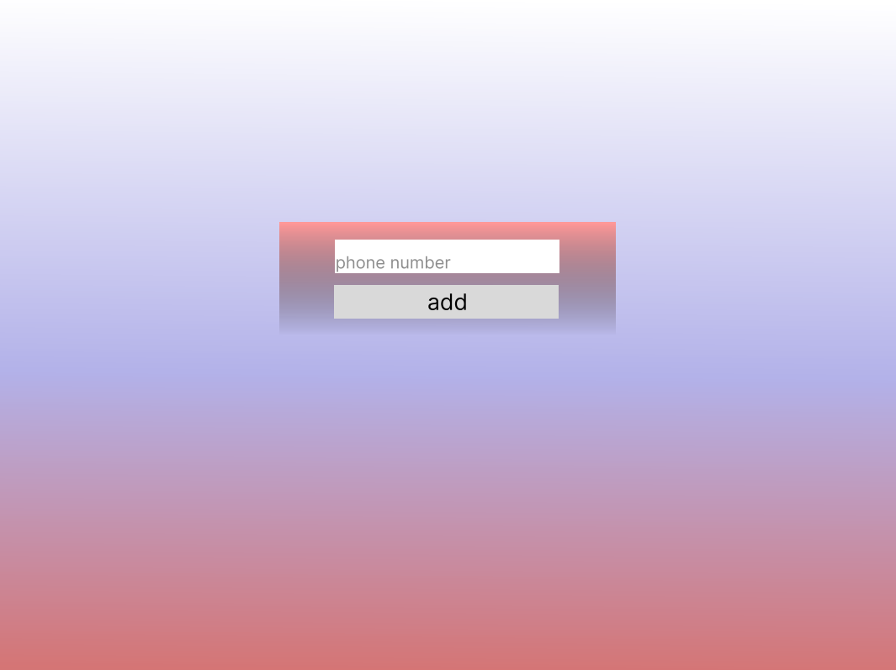

# Домашнее задание 12
## Структура приложения с пользовательским интерфейсом и базой данных

Архитектура: MVP (Model-View-Presenter)
MVP была выбрана, так как она обеспечивает разделение логики приложения на три основных компонента: модель, представление и презентер. Это позволяет упростить разработку и поддержку приложения, а также обеспечить его масштабируемость.

Желаемая ERD:

Итоговая ERD:

Планируемый дизайн:

## Реализация мессенджера

На базе языка java спроектированы: страничка авторизации с кнопками входа и регистрации; Страничка регистрации с добавлением пары логина и пароля в текстовый файл; окно мессенджера.

[Проект](https://github.com/PolitovAS/Software_architecture/tree/main/HW_11/src)

## Тестирование

В процессе UAT-тестирования программы были выявлены следующие недоработки программы:
1. Не работает кнопка добавления нового контакта;
2. Не отправляются сообщения;